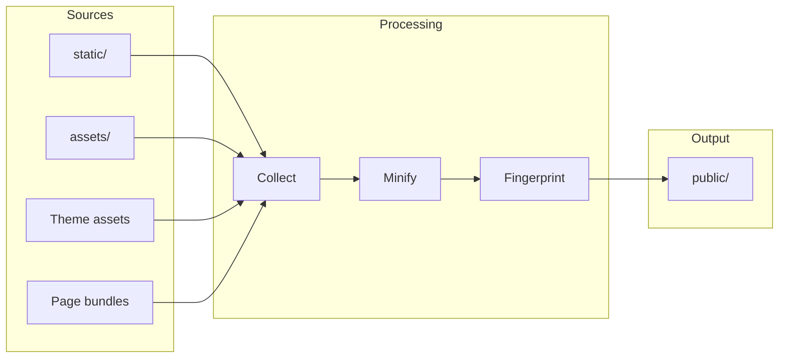

# Asset Pipeline

Bengal processes your CSS, JavaScript, images, and fonts with optional minification and fingerprinting.

## How Assets Flow



## Asset Locations

| Location | Copied To | Processing | Use For |
|----------|-----------|------------|---------|
| `static/` | `public/` | None | Files that don't need processing |
| `assets/` | `public/` | Full pipeline | CSS/JS needing minification |
| Theme's `static/` | `public/` | None | Theme's static files |
| Page bundles | `public/` | Scope-limited | Page-specific images/data |

## Quick Reference

:::{tab-set}
:::{tab-item} Configuration
```toml
# bengal.toml
[assets]
minify = true
optimize = true
fingerprint = true   # main.css → main.a1b2c3.css
```
:::

:::{tab-item} Template Usage
```kida
{# Basic asset URL (function syntax) #}
<link rel="stylesheet" href="{{ asset_url('css/main.css') }}">

{# Fingerprinting is automatic when enabled in config #}
{# Outputs: /assets/css/main.a1b2c3.css #}

{# Images #}

```
:::

:::{tab-item} Page Bundle Assets
```kida
{# Access assets co-located with current page #}

  

```
:::
:::{/tab-set}

:::{tip}
**Fingerprinting** adds a hash to filenames (`main.a1b2c3.css`) for cache-busting. Enable it in production for optimal caching.
:::

## Icons

Bengal includes a comprehensive [Icon Reference](/docs/reference/icons/) powered by Phosphor Icons. Use inline icons in content with `{icon}`name`` syntax:

```markdown
{icon}`check:24:icon-success` Task complete!
```

For custom icons, place SVG files in `themes/your-theme/assets/icons/`. See the [Icon Reference](/docs/reference/icons/) for the full gallery and customization options.
