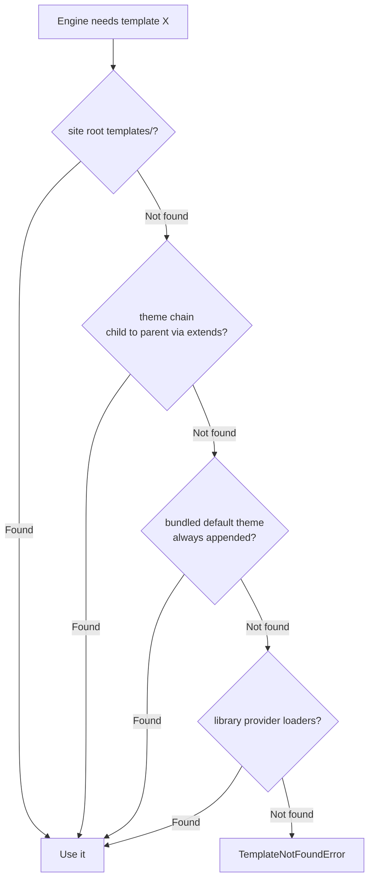

# What Bengal Provides vs What Your Theme Provides

Before you build or customize a theme, it helps to know where Bengal's
responsibilities end and yours begin. The line is simple to state:

> **Core owns the capability** — parsing, registering, and computing the render
> context. **Your theme owns the presentation** — the `*.html` template and the
> CSS that style what core hands it.

A directive like `note` or `tabs` is *parsed* and *registered* in core; its
visual shell (the HTML wrapper, the icon, the color) lives in a template and a
stylesheet. The same split holds for shortcodes, layouts, and partials. This
page explains how that split is enforced at render time, so you know exactly
what you inherit for free and what you must supply yourself.

## Template Resolution: First Match Wins

When the engine needs a template — a layout like `page.html`, a partial like
`partials/header.html`, or a capability template like `directives/note.html` —
it searches a precedence-ordered list of directories. The first directory that
contains a matching file wins.

The search order, in precedence:

1. **Site root `templates/`** — your project's top-level `templates/` directory.
   Anything you put here wins over everything else. This is what
   `bengal theme swizzle` populates.
2. **The active theme chain** — your theme, then its parent, then its
   grandparent, walking the `extends` key in each `theme.toml` from child to
   parent. (A child theme's chain has `default` filtered out of this step,
   because core appends it separately in the next step.)
3. **The bundled `default` theme** — *always* appended as the final filesystem
   fallback, even when your theme never names it. It is added once (deduplicated
   against the chain above), so a project always has a complete set of layouts,
   partials, and capability templates to fall back to.
4. **Library provider loaders** — themes that ship a packaged component library
   (declared via `libraries` in `theme.toml`) contribute their own loaders
   *after* the filesystem search, through a `ChoiceLoader`.

If a template is found at any step, the search stops. If even the bundled
`default` theme (and any provider loaders) lack it, the engine raises a
`TemplateNotFoundError`.

The filesystem precedence is assembled in
`bengal/rendering/template_engine/environment.py` (`resolve_template_dirs()`),
where the bundled default is unconditionally appended last; the provider loaders
are layered on top in `bengal/rendering/engines/kida.py` (`_build_loader()`).

The practical takeaway: **the bundled `default` theme is the safety net**. As
long as you do not break the fallback, every layout and capability template
resolves to *something*.

## Directives vs Shortcodes: An Asymmetry in Fallback

Both directives and shortcodes are content-authoring features that core parses
and that themes can style. But they differ in one crucial way: **a directive
renders even when no theme template exists; a shortcode does not.**

| | Directives | Shortcodes |
|---|---|---|
| **Where parsed** | Core, in `bengal/parsing/backends/patitas/directives/` | Core, in `bengal/rendering/shortcodes.py` |
| **The set** | Fixed — around two dozen built-in handler types (`note`, `warning`, `tip`, `tabs`, `cards`, `dropdown`, `steps`, …), registered in `directives/registry.py` | Open — any `` is accepted by name |
| **Extensible by** | **Plugins only** (`bengal/plugins/integration.py`), not themes | Adding a template; the name space is unbounded |
| **Theme template** | Optional override: `templates/directives/{name}.html` | Required to render: `templates/shortcodes/{name}.html` |
| **Missing template** | Falls back to a built-in Python `render()` — still produces HTML | Passes the raw shortcode text through unchanged (or errors in strict mode) |
| **Net result** | Renders with **zero** theme templates | The default theme's templates are the **de-facto standard library** |

### Why directives always render

When a directive renders, the renderer first asks the handler for a render
context (`get_template_context()`) and tries to render a theme template — first
`directives/{name}.html` (per-type, e.g. `note.html`), then
`directives/{token_type}.html` (handler-level, e.g. `admonition.html`). When no
template is found, that lookup returns `None` and the renderer falls through to
the handler's own `handler.render(...)` — a Python fallback that emits HTML
directly (see `bengal/parsing/backends/patitas/renderers/directives.py`, the
`_try_template_render()` / `handler.render()` path).

So directives are guaranteed to produce HTML with no theme templates at all. A
theme *optionally* overrides `templates/directives/{name}.html` (plus the
matching CSS) to change presentation, but it never *has* to.

Directives are a fixed set. You cannot add a new directive by dropping a
template into your theme — the handler must be registered in core, and the only
sanctioned extension point is a **plugin** that registers a handler through
`apply_plugin_directives()` in `bengal/plugins/integration.py`.

### Why shortcodes need a template

Shortcodes have **no engine-level fallback**. When `_render_shortcode()` in
`bengal/rendering/shortcodes.py` looks up `shortcodes/{name}.html` and the
template does not exist:

- In normal mode, it returns the **raw shortcode text unchanged** — the
  `` literal leaks into the output.
- In strict mode (`shortcodes.strict = true` in your site config), it raises a
  `BengalRenderingError` (`ErrorCode.T001`) telling you to add the template or
  disable strict mode.

Because there is no Python fallback, **whichever shortcode templates the active
theme provides** define what shortcodes actually work on your site. The bundled
`default` theme's `templates/shortcodes/` directory is therefore the de-facto
standard library of shortcodes; if you extend `default`, you inherit all of
them, and if you fork away from it, any shortcode you use must be re-provided.

## Implications for Theme Authors

The fallback chain and the directive/shortcode asymmetry add up to a clear rule
of thumb about how much work your theme is signing up for.

### A theme that extends `default`

When your `theme.toml` declares `extends = "default"` (or your theme is a
site-local theme layered over the default), you inherit **every** capability
template — all the directive templates, all the shortcode templates — and the
default theme's component CSS at
`bengal/themes/default/assets/css/components/` (for example `admonitions.css`,
`tabs.css`, `dropdowns.css`, `steps.css`, `cards.css`, `checklist.css`,
`code.css`). You override only the templates and styles you actually want to
change; everything else resolves through the fallback chain. This is the
low-effort path.

### A theme that does not extend `default`

A theme with no `extends` key — such as the in-repo `chirpui` theme, whose
`theme.toml` sets `name = "chirpui"` with no parent — does **not** inherit the
default theme's capability templates or CSS through the *chain*. (The bundled
default is still appended as the final filesystem fallback, but a from-scratch
theme that means to fully control presentation typically re-provides its own
templates rather than leaning on that fallback.) To deliver a complete,
self-consistent look, such a theme must re-provide every capability template
*and* its directive CSS. That is the structural reason a non-extending theme is
effectively a full fork: there is no Python fallback for shortcodes, and
overriding directive presentation cohesively means owning the templates and
stylesheets end to end.

### The path to portable capability templates

Today, the cleanest way to get every capability template for free is to extend
`default`. The longer-term direction — a stable view-model contract so
capability templates can be authored portably and shared across themes without
forking the default theme — is tracked in issue #335, issue #337, and issue
#338. Those issues are the route toward capability templates that travel between
themes through a documented contract rather than by inheritance from one
specific theme.

## See Also

- [Create a Theme](../theme-creation/) — scaffold, override, and test a theme.
- [Working with Themes](../themes/) — use, customize, or build a theme.
- [Theme Library Assets](../themes/library-assets/) — the provider contract for
  packaged component libraries.
