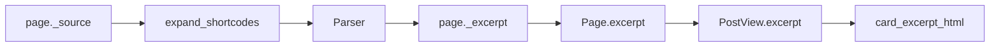

# Excerpt Pipeline

This document describes the canonical data flow for excerpts in Bengal. The same pattern applies to other content-transform flows (changelog summaries, product descriptions, etc.).

## Data Flow



1. **Source**: `page._source` (raw Markdown) is expanded for shortcodes, then parsed.
2. **Extraction**: The parser sets `page._excerpt` from the first content block. Extraction runs regardless of whether a table of contents is generated; the pipeline always uses the toc-aware parse path and discards TOC when not needed. This ensures pages without headings (short posts, changelog entries, tutorial steps) still get `page._excerpt` populated.
3. **Fallback**: `Page.excerpt` property (see `bengal/core/page/__init__.py`) returns `page._excerpt` if set, else `compute_excerpt(_raw_content)`.
4. **PostView**: `PostView.from_page()` sets `excerpt = page.excerpt or ""` and `description = meta.get("description") or params.get("description") or excerpt`.
5. **card_excerpt_html**: Strips title/description duplicates, then truncates. If stripping yields empty but original content exists, falls back to truncated original.

## Fallback Behavior

When excerpt equals description (common for frontmatter-only posts), stripping removes everything. `card_excerpt_html` detects this and returns the truncated original instead of `""`.

```kida
{{ p.excerpt | card_excerpt_html(35, p.title, p.description) | safe }}
```

Use `p.excerpt or p.description` when either may be empty (e.g. in post cards).

## Related

- [String & Date Filters](/docs/reference/template-functions/string-date-filters/) — `excerpt`, `excerpt_for_card`, `card_excerpt`, `card_excerpt_html`
