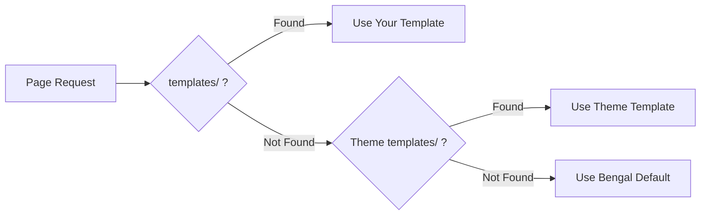
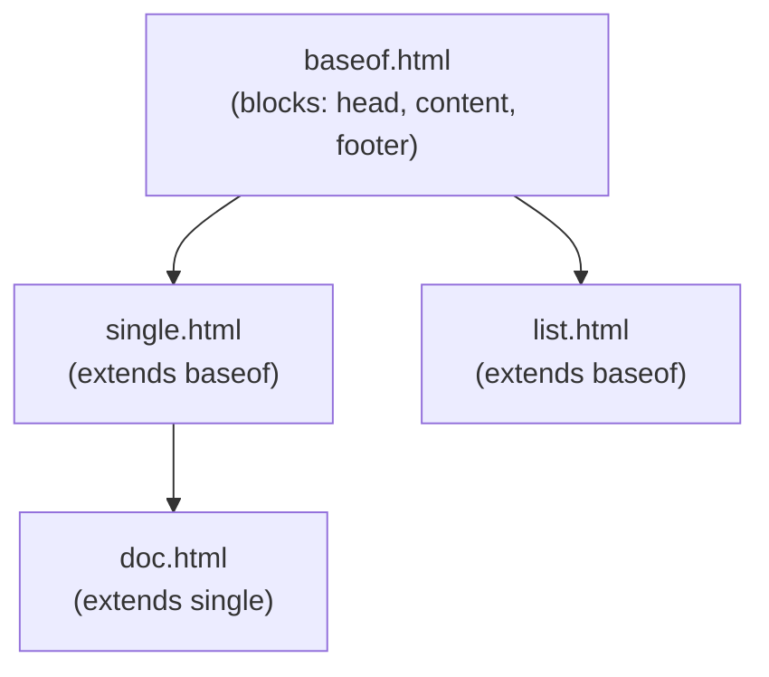

# Templating

Bengal's template system uses **Kida** as the default engine, with support for Jinja2 and custom engines.

## Template Engines

- **[Kida](/docs/reference/kida-syntax/)** — Bengal's native template engine (default). Unified `` blocks, pattern matching, pipeline operators
- **[Jinja2](https://jinja.palletsprojects.com/)** — Industry-standard engine with excellent documentation and tooling
- **Custom engines** — Bring your own via the plugin API

:::{tip}
**Kida is Jinja2-compatible**: Your existing Jinja2 templates work without changes. Use Kida-specific features incrementally.
:::

## Template Lookup Order



Bengal searches: **Your project** → **Theme** → **Bengal defaults**

## Quick Start

:::{tab-set}
:::{tab-item} Basic Template
```kida
{# templates/layouts/single.html #}



<article>
  <h1>{{ page.title }}</h1>
  {{ page.content | safe }}
</article>

```
:::

:::{tab-item} Base Layout
```kida
{# templates/baseof.html #}
<!DOCTYPE html>
<html>
<head>
  <title>{{ page.title }}</title>
</head>
<body>
  
  
  
</body>
</html>
```
:::

:::{tab-item} Partial
```kida
{# templates/partials/header.html #}
<header>
  <nav>
    
      <a href="{{ item.href }}">{{ item.title }}</a>
    
  </nav>
</header>
```
:::
:::{/tab-set}

## Key Concepts

| Concept | Syntax | Purpose |
|---------|--------|---------|
| **Extends** | `` | Inherit from parent template |
| **Block** | `...` | Replaceable section |
| **Include** | `` | Insert another template |
| **Variable** | `{{ page.title }}` | Output a value |
| **Filter** | `{{ text \| truncate(100) }}` | Transform a value |

## Template Inheritance



## Kida Features

Kida is Bengal's default template engine:

- **Unified syntax**: `` closes all blocks (no more ``, ``)
- **Pattern matching**: `...` for cleaner conditionals
- **Pipeline operator**: `|>` for readable filter chains
- **Fragment caching**: Built-in `` directive
- **Jinja2 compatible**: Existing Jinja2 templates work without changes

:::{cards}
:columns: 2
:gap: small

:::{card} Kida Syntax Reference
:icon: book
:link: /docs/reference/kida-syntax/
:description: Complete Kida syntax documentation
:::{/card}

:::{card} Kida Tutorial
:icon: notepad
:link: /docs/tutorials/getting-started-with-kida/
:description: Learn Kida from scratch
:::{/card}

:::{card} Kida How-Tos
:icon: code
:link: /docs/theming/templating/kida/
:description: Common Kida tasks and patterns
:::{/card}

:::{card} Migrate from Jinja2
:icon: arrow-right
:link: /docs/theming/templating/kida/migration/from-jinja/
:description: Convert Jinja2 templates to Kida
:::{/card}
:::{/cards}

## Choose Your Engine

Kida is the default. To use a different engine, configure `bengal.yaml`:

```yaml
site:
  template_engine: jinja2  # Options: kida (default), jinja2, mako, patitas
```

### Custom Engines (BYOR)

Bring your own template engine via the protocol API. Your engine automatically gets all 80+ template functions if it satisfies the `TemplateEnvironment` protocol:

```python
from bengal.rendering.engines import register_engine
from bengal.rendering.template_functions import register_all

class MyEngine:
    def __init__(self, site):
        self.site = site
        self.template_dirs = [site.root_path / "templates"]

        # Environment must have globals, filters, tests dicts
        self._env = MyEnvironment()

        # Automatically get all 80+ template functions!
        register_all(self._env, site)

    def render_template(self, name: str, context: dict) -> str:
        # Your implementation
        ...

register_engine("myengine", MyEngine)
```

Then configure:

```yaml
site:
  template_engine: myengine
```

See [Bring Your Own Template Engine](/docs/theming/templating/custom-engine/) for the complete guide.

:::{tip}
**Override sparingly**: You only need to create templates you want to customize. Use `bengal utils theme swizzle <template>` to copy a template for customization. Let the rest fall through to theme defaults.
:::
