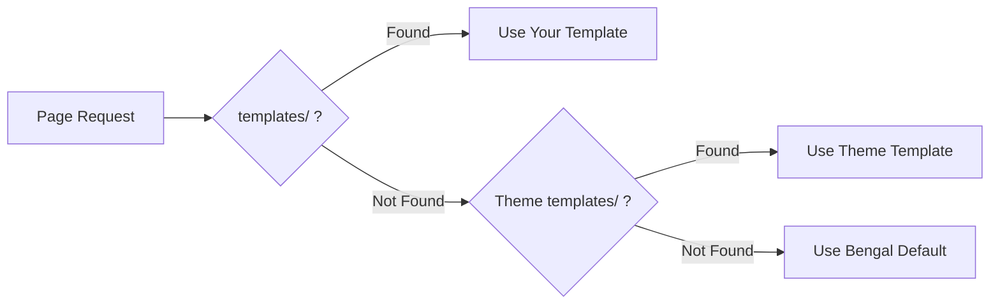
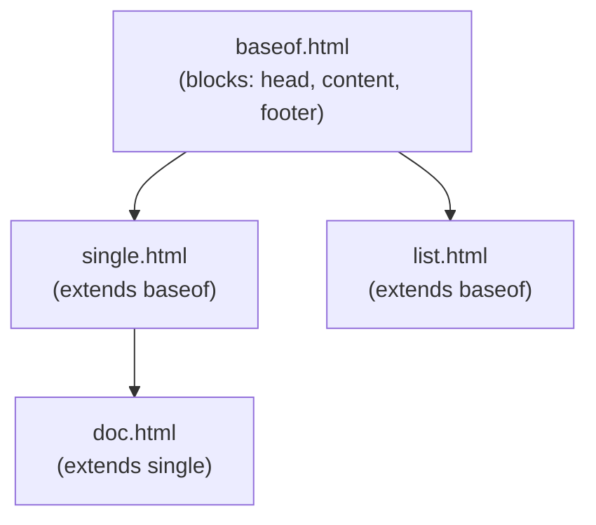

# Jinja2 Templating

Bengal uses [Jinja2](https://jinja.palletsprojects.com/) for all templates. If you know Python, you'll feel at home.

## Template Lookup Order



Bengal searches: **Your project** → **Theme** → **Bengal defaults**

## Quick Start

:::{tab-set}
:::{tab-item} Basic Template
```jinja
{# templates/layouts/single.html #}



<article>
  <h1>{{ page.title }}</h1>
  {{ page.content | safe }}
</article>

```
:::

:::{tab-item} Base Layout
```jinja
{# templates/baseof.html #}
<!DOCTYPE html>
<html>
<head>
  <title>{{ page.title }}</title>
</head>
<body>
  
  
  
</body>
</html>
```
:::

:::{tab-item} Partial
```jinja
{# templates/partials/header.html #}
<header>
  <nav>
    
      <a href="{{ item.url }}">{{ item.title }}</a>
    
  </nav>
</header>
```
:::
:::{/tab-set}

## Key Concepts

| Concept | Syntax | Purpose |
|---------|--------|---------|
| **Extends** | `` | Inherit from parent template |
| **Block** | `...` | Replaceable section |
| **Include** | `` | Insert another template |
| **Variable** | `{{ page.title }}` | Output a value |
| **Filter** | `{{ text \| truncate(100) }}` | Transform a value |

## Template Inheritance



:::{tip}
**Override sparingly**: You only need to create templates you want to customize. Start by copying one template from your theme, modify it, and let the rest fall through to defaults.
:::
