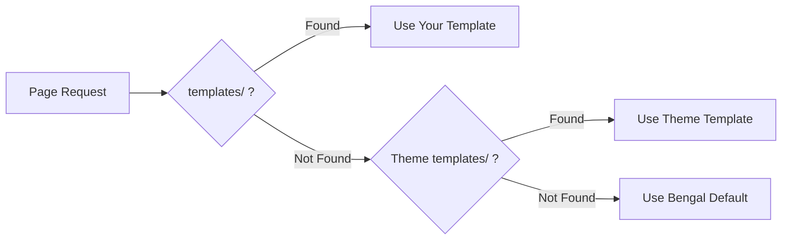
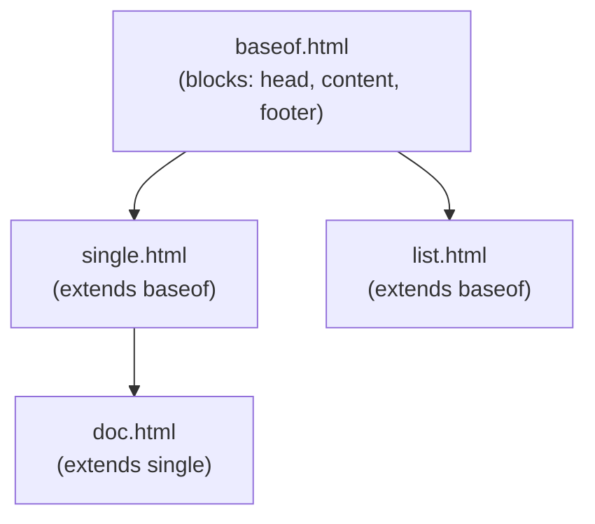

# Templating

Bengal supports two template engines:

- **[Jinja2](https://jinja.palletsprojects.com/)** — Default, widely-used template engine
- **[KIDA](/docs/reference/kida-syntax/)** — Bengal's native template engine (5.6x faster, modern syntax)

:::{tip}
**New to Bengal?** Start with Jinja2 if you're familiar with it. Try KIDA for better performance and modern features like pattern matching and pipeline operators.
:::

## Template Lookup Order



Bengal searches: **Your project** → **Theme** → **Bengal defaults**

## Quick Start

:::{tab-set}
:::{tab-item} Basic Template
```jinja2
{# templates/layouts/single.html #}



<article>
  <h1>{{ page.title }}</h1>
  {{ page.content | safe }}
</article>

```
:::

:::{tab-item} Base Layout
```jinja2
{# templates/baseof.html #}
<!DOCTYPE html>
<html>
<head>
  <title>{{ page.title }}</title>
</head>
<body>
  
  
  
</body>
</html>
```
:::

:::{tab-item} Partial
```jinja2
{# templates/partials/header.html #}
<header>
  <nav>
    
      <a href="{{ item.href }}">{{ item.title }}</a>
    
  </nav>
</header>
```
:::
:::{/tab-set}

## Key Concepts

| Concept | Syntax | Purpose |
|---------|--------|---------|
| **Extends** | `` | Inherit from parent template |
| **Block** | `...` | Replaceable section |
| **Include** | `` | Insert another template |
| **Variable** | `{{ page.title }}` | Output a value |
| **Filter** | `{{ text \| truncate(100) }}` | Transform a value |

## Template Inheritance



## KIDA Templates

KIDA is Bengal's native template engine with modern syntax and better performance:

- **Unified syntax**: `` closes all blocks
- **Pattern matching**: `...` for cleaner conditionals
- **Pipeline operator**: `|>` for readable filter chains
- **Fragment caching**: Built-in `` directive

:::{cards}
:columns: 2
:gap: small

:::{card} KIDA Syntax Reference
:icon: book
:link: /docs/reference/kida-syntax/
:description: Complete KIDA syntax documentation
:::{/card}

:::{card} KIDA Tutorial
:icon: notepad
:link: /docs/tutorials/getting-started-with-kida/
:description: Learn KIDA from scratch
:::{/card}

:::{card} KIDA How-Tos
:icon: code
:link: /docs/theming/templating/kida/
:description: Common KIDA tasks and patterns
:::{/card}

:::{card} Migrate from Jinja2
:icon: arrow-right
:link: /docs/theming/templating/kida/migrate-jinja-to-kida/
:description: Convert Jinja2 templates to KIDA
:::{/card}
:::{/cards}

## Enable KIDA

To use KIDA instead of Jinja2, configure `bengal.yaml`:

```yaml
site:
  template_engine: kida
```

:::{tip}
**Override sparingly**: You only need to create templates you want to customize. Use `bengal utils theme swizzle <template>` to copy a template for customization. Let the rest fall through to theme defaults.
:::
