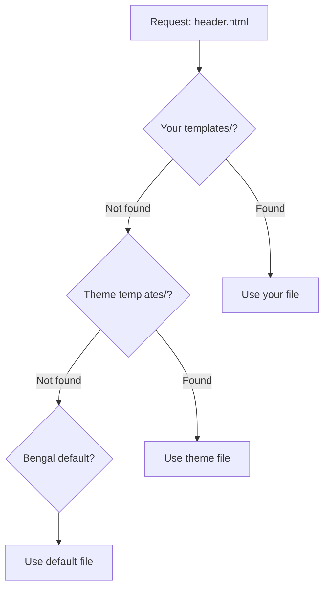

# Working with Themes

Themes are complete design packages. Use one as-is, customize it, or build your own.

## Theme Resolution



Your files always win. Override only what you need.

## Choose Your Approach

::::{cards}
:columns: 3
:gap: small

:::{card} 🎨 Use Default
**Effort**: None

Works out of the box. Set colors via CSS variables.
:::

:::{card} ✏️ Customize
**Effort**: Low-Medium

Override specific templates. No forking required.
:::

:::{card} 🏗️ Create New
**Effort**: High

Full control. Start from scratch or fork existing.
:::
::::

## Quick Reference

::::{tab-set}
:::{tab-item} Use a Theme
```toml
# bengal.toml
[theme]
name = "default"
```
:::

:::{tab-item} CSS Variables
```css
/* static/css/custom.css */
:root {
  --color-primary: #3b82f6;
  --color-background: #0f172a;
  --font-family-base: "Inter", sans-serif;
}
```

Include in your config:
```toml
[theme.config]
custom_css = ["css/custom.css"]
```
:::

:::{tab-item} Override Template
```
your-project/
└── templates/
    └── partials/
        └── header.html  # Your version wins
```

Copy the original from `themes/default/templates/`, modify as needed.
:::
::::

## Theme Contents

| Directory | Purpose |
|-----------|---------|
| `templates/` | HTML templates (Jinja2) |
| `static/` | CSS, JS, images |
| `assets/` | Processed assets |
| `theme.toml` | Theme configuration |

:::{tip}
**Start minimal**: Override CSS variables first. Only copy templates when you need structural changes. The less you override, the easier upgrades will be.
:::
