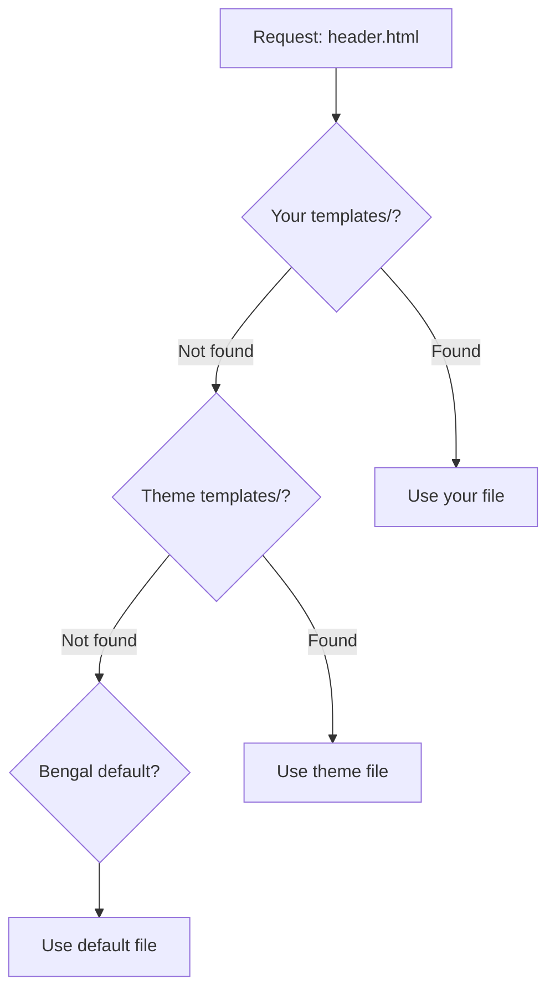

# Working with Themes

Themes are complete design packages. Use one as-is, customize it, or build your own.

## Theme Resolution


```mermaid
flowchart TB
    A[Request: header.html]
    B{Your templates/?}
    C{Theme templates/?}
    D{Bengal default?}
    E[Use your file]
    F[Use theme file]
    G[Use default file]

    A --> B
    B -->|Found| E
    B -->|Not found| C
    C -->|Found| F
    C -->|Not found| D
    D --> G
```

Your files always win. Override only what you need.

## Choose Your Approach

:::{cards}
:columns: 3
:gap: small

:::{card} 🎨 Use Default
**Effort**: None

Works out of the box. Set colors via CSS variables.
:::

:::{card} ✏️ Customize
**Effort**: Low-Medium

Override specific templates. No forking required.
:::

:::{card} 🏗️ Create New
**Effort**: High

Full control. Start from scratch or fork existing.
:::
:::{/cards}

## Bundled Themes

| Theme | Use when |
|-------|----------|
| `default` | You want Bengal's built-in documentation theme with no extra packages. |
| `chirpui` | You want a site rendered with Chirp UI components and can install `chirp-ui` in the build environment. |

Theme authors can package reusable component systems with [theme library asset
contracts](./library-assets/). Bengal will load the package templates, emit the
declared CSS/JS in both dev and static builds, and warn or fail when rendered
HTML references missing local assets.

## Quick Reference

:::{tab-set}
:::{tab-item} Use a Theme
```toml
# bengal.toml
[theme]
name = "default"
```
:::

:::{tab-item} CSS Variables
```css
/* static/css/custom.css */
:root {
  --color-primary: #3b82f6;
  --color-background: #0f172a;
  --font-family-base: "Inter", sans-serif;
}
```

Include in your template:
```html
<link rel="stylesheet" href="{{ asset_url('css/custom.css') }}">
```

Or store the path in `[theme.config]` and reference it:
```toml
[theme.config]
custom_css = ["css/custom.css"]
```

Then in your template:
```html

<link rel="stylesheet" href="{{ asset_url(css_file) }}">

```
:::

:::{tab-item} Override Template
```tree
your-project/
└── templates/
    └── partials/
        └── header.html  # Your version wins
```

Use `bengal theme swizzle partials/header.html` (or `bengal utils theme swizzle`) to copy the original, then modify as needed.
:::
:::{/tab-set}

## Theme Contents

| Directory | Purpose |
|-----------|---------|
| `templates/` | HTML templates (Kida) |
| `static/` | CSS, JS, images |
| `assets/` | Processed assets |
| `theme.toml` | Theme configuration |

:::{tip}
**Start minimal**: Override CSS variables first. Only copy templates when you need structural changes. The less you override, the easier upgrades will be.
:::
