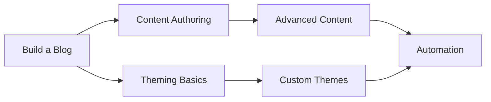

# Tutorials

Hands-on lessons that teach you Bengal step-by-step. Each tutorial starts from scratch and builds to a working result.

## Choose Your Starting Point

::::{cards}
:columns: 1
:gap: medium

:::{card} 📝 Build a Blog from Scratch
:link: ./build-a-blog/
:color: blue

**15 minutes** · For writers and beginners

Go from zero to a deployed personal blog. The perfect first tutorial.
:::

:::{card} 🔄 Migrate from Hugo
:link: ./migrate-from-hugo/
:color: green

**30 minutes** · For existing SSG users

Step-by-step migration from Hugo, Jekyll, Gatsby, or other static site generators.
:::

:::{card} ⚙️ Automate with GitHub Actions
:link: ./automate-with-github-actions/
:color: purple

**20 minutes** · For DevOps

Set up CI/CD pipelines for automatic builds, testing, and deployment.
:::
::::

## Learning Journey

:::{tip}
**After tutorials**: Move to [Content](../content/) for authoring reference, [Theming](../theming/) for customization, or [Building](../building/) for deployment options.
:::

:::{dropdown} What makes a good tutorial?
Tutorials are **learning-oriented** — they teach skills through guided practice.

Each tutorial:
- **Starts from scratch** — No prior Bengal knowledge assumed
- **Builds progressively** — Each step builds on the previous
- **Provides working code** — Copy, run, and see results
- **Explains the "why"** — Understand concepts as you go

This follows the [Diátaxis](https://diataxis.fr/) documentation framework.
:::
