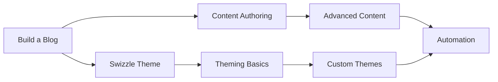

# Tutorials

Hands-on lessons that teach you Bengal step-by-step. Each tutorial starts from scratch and builds to a working result.

## Choose Your Starting Point

:::{cards}
:columns: 1
:gap: medium

:::{card} Build a Blog from Scratch
:icon: pencil
:link: ./build-a-blog/
:description: Go from zero to a deployed personal blog in 15 minutes
:badge: Start Here
:color: blue
The perfect first tutorial for writers and beginners. No prior Bengal knowledge required.
:::{/card}

:::{card} Swizzle and Customize the Default Theme
:icon: palette
:link: ./swizzle-default-theme/
:description: Learn theme inheritance without breaking updates
:color: orange
Copy and customize just the templates you need. Perfect for personalizing your site while staying compatible with theme updates.
:::{/card}

:::{card} Coming From Another Tool?
:icon: arrow-right
:link: ./onboarding/
:description: Quick-start guides for Hugo, Sphinx, and Docusaurus users
:color: green
Feature mapping and syntax translation for users migrating from other static site generators.
:::{/card}

:::{card} Automate with GitHub Actions
:icon: settings
:link: ./automate-with-github-actions/
:description: Set up CI/CD pipelines for automatic deployment
:color: purple
Configure GitHub Actions for automatic builds, testing, and deployment to GitHub Pages, Netlify, or Vercel.
:::{/card}
:::{/cards}

## Learning Journey



:::{tip}
**After tutorials**: Move to [Content](../content/) for authoring reference, [Theming](../theming/) for customization, or [Building](../building/) for deployment options.
:::

:::{dropdown} What makes a good tutorial?
:icon: info
Tutorials are **learning-oriented** — they teach skills through guided practice.

Each tutorial:

- **Starts from scratch** — No prior Bengal knowledge assumed
- **Builds progressively** — Each step builds on the previous
- **Provides working code** — Copy, run, and see results
- **Explains the "why"** — Understand concepts as you go

This follows the [Diátaxis](https://diataxis.fr/) documentation framework.
:::

## Troubleshooting

:::{dropdown} Command not found
:icon: warning

Ensure Python's bin directory is in your PATH.

If using a virtual environment, activate it:

```bash
source .venv/bin/activate
```

Try reinstalling:

```bash
pip uninstall bengal && pip install bengal
```

:::

:::{dropdown} Python version errors
:icon: warning

Verify your Python version:

```bash
python --version
# or
python3 --version
```

Install Python 3.14+ using [pyenv](https://github.com/pyenv/pyenv) or the [official installer](https://www.python.org/downloads/).
:::

:::{dropdown} Permission errors
:icon: warning

Use the `--user` flag:

```bash
pip install --user bengal
```

Or use a virtual environment:

```bash
python -m venv venv && source venv/bin/activate
```

:::
